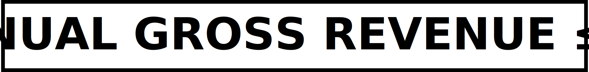

# ZPE-IMC

  
  
  
  
  

  
  
  
  
  
  
  

  

  

  Information has always had more dimensions than text. A surgeon needs haptic
  feedback. A perfumer works in molecules. A composer works in time and tone.
  An AI agent navigating the world perceives all of these at once. Until now,
  each modality required its own codec, its own schema, its own transport layer.

  <strong>ZPE-IMC encodes ten modalities — text, emoji, diagram, image, music,
  voice, mental state, touch, smell, and taste — through a single 20-bit
  transport word.</strong> Collision-aware dispatch keeps every lane separated.
  Transport is implemented as eight lane families: <code>TEXT_EMOJI</code>,
  <code>DIAGRAM_IMAGE</code>, <code>MUSIC</code>, <code>VOICE</code>,
  <code>MENTAL</code>, <code>TOUCH</code>, <code>SMELL</code>, and
  <code>TASTE</code>. Round-trip fidelity is byte-identical and deterministic:
  the same input always produces the same output.

  No neural network. No training loop. No GPU required to run it. This is
  Zero-Point Encoding (ZPE) — an N-primitive directional encoding family
  with Compass-8 (P8) as its canonical profile — and ZPE-IMC is its
  Wave-1 integration and dispatch layer.

  <strong>Current repository posture</strong>: this front door is curated as
  the current authority snapshot ahead of the first tagged public release.
  Treat the clone/install path below as repository verification guidance, not
  as packaged public-release guidance.

  <strong>Current public audit acquisition surface</strong>:
  <code>https://github.com/Zer0pa/ZPE-IMC.git</code> is the provisioned
  reachable clone target. That uploaded snapshot can lag the live working tree,
  but it is the real acquisition surface auditors can actually be pointed to.

  <strong>Current operator authority (2026-03-07)</strong>: the accepted
  run-of-record is the saturated Rust-backed native kernel path. Build and
  install it with <code>./code/rust/imc_kernel/build_install.sh</code>, verify
  it with <code>zpe_multimodal.core.imc.get_kernel_backend_info()</code>, and
  treat <code>proofs/logs/phase6_run_of_record_manifest.json</code> plus
  <code>proofs/logs/phase6_comet_run.txt</code> as the current runtime
  authority artifacts. The accepted March 7 run is
  <code>IMC-Canonical-20260307T131330Z</code> with
  <code>169/169</code> tests passing,
  <code>benchmark_run_id=A4-BENCH-20260307T131414Z</code>, and
  <code>canonical_total_words_per_sec=276798.7185</code>.

  <strong>Historical note</strong>: the earlier
  <code>total_words=844</code> Wave-1 demo anchor is retained as historical
  context only. It is not the current operator authority path for the live
  Rust-backed kernel.

  <strong>Core public claim</strong>: ZPE-IMC is a deterministic, unified,
  CPU-native multimodal transport system with real modality integration and
  real runtime proof discipline. The governing claim is transport integrity
  across mixed modalities, not human-equivalence semantics or commodity
  compression supremacy.

<strong>Three dimensions of current authority</strong>:

<ul>
  <li><strong>Dimension 1</strong>: integrated modality transport is real and current on the accepted IMC path.</li>
  <li><strong>Dimension 2</strong>: the Rust-enhanced runtime is real and preserves semantics, determinism, proofs, and observability while exceeding the baseline.</li>
  <li><strong>Dimension 3</strong>: provenance and custody discipline explain how the current authority state emerged without turning archive material into live operator truth.</li>
</ul>

  <strong>Authority surfaces</strong>: this working source repository is the
  current truth surface. The current public audit acquisition surface is
  <code>https://github.com/Zer0pa/ZPE-IMC.git</code>. Uploaded snapshots can
  omit files or carry path defects and do not outrank the source repo.
  Historical/archive material explains lineage and caveats, but it is not the
  current operator authority path.

  

<table width="100%" cellpadding="0" cellspacing="0">
  <tr>
    <td width="50%" valign="top">
      
<strong>License (SAL v6.0) — Free Tier Boundary</strong>

      

        
      

      <ul>
        <li>SPDX tag: <code>LicenseRef-Zer0pa-SAL-6.0</code>.</li>
        <li>Commercial/hosted above threshold requires contact at <a href="mailto:architects@zer0pa.ai">architects@zer0pa.ai</a>.</li>
        <li>Historical release chronology is retained in <code>CHANGELOG.md</code> and <code>CITATION.cff</code>. It is not current clone/install guidance for this front door.</li>
      </ul>
    </td>
    <td width="50%" valign="top">
      
<strong>Public audit acquisition and verification</strong>

      <pre><code class="language-bash">git clone https://github.com/Zer0pa/ZPE-IMC.git zpe-imc
cd zpe-imc
python -m venv .venv
source .venv/bin/activate
python -m pip install -e "./code[full,bench,dev]"
./code/rust/imc_kernel/build_install.sh
python - <<'PY'
from zpe_multimodal.core.imc import get_kernel_backend_info
print(get_kernel_backend_info())
PY
python ./executable/run_with_comet.py
# optional internal live logging only:
# COMET_API_KEY=... OPIK_API_KEY=... python ./executable/run_with_comet.py --enable-classic-comet --enable-opik</code></pre>
      
Current authority point: <code>proofs/logs/phase6_run_of_record_manifest.json</code>

    </td>
  </tr>
</table>

  

<strong>Runtime Proof (Current)</strong>: the current operator authority is
the saturated Rust-backed phase6 run-of-record. The native build/install path
is <code>code/rust/imc_kernel/build_install.sh</code>, the backend verifier is
<code>zpe_multimodal.core.imc.get_kernel_backend_info()</code>, and the current
proof anchors are <code>proofs/logs/phase6_run_of_record_manifest.json</code>
and <code>proofs/logs/phase6_comet_run.txt</code>.

<table width="100%" border="1" bordercolor="#b8c0ca" cellpadding="0" cellspacing="0">
  <thead>
    <tr>
      <th align="left">Proof rung</th>
      <th align="left">Locked value</th>
      <th align="left">Meaning</th>
    </tr>
  </thead>
  <tbody>
    <tr><td>Run-of-record manifest</td><td><code>PASS</code></td><td>Current live authority artifact with backend truth, saturation facts, benchmark id, and live URLs.</td></tr>
    <tr><td>Native backend truth</td><td><code>backend=rust</code>, <code>compiled_extension=1</code>, <code>fallback_used=0</code></td><td>The accepted runtime is the compiled Rust extension, not a Python fallback.</td></tr>
    <tr><td>Current saturated rerun</td><td><code>run_name=IMC-Canonical-20260307T131330Z</code>, <code>169/169</code> tests PASS, <code>8</code> workers, <code>benchmark_run_id=A4-BENCH-20260307T131414Z</code></td><td>Later accepted March 7 run-of-record; this supersedes the earlier same-day rerun.</td></tr>
    <tr><td>Current throughput authority</td><td><code>canonical_total_words_per_sec=276798.7185</code>, <code>throughput_encode_words_per_sec=94104.7837</code>, <code>throughput_decode_words_per_sec=296145.6735</code></td><td>Current saturated steady-state wrapper ceiling for the accepted Rust-backed run.</td></tr>
    <tr><td>Historical demo anchor</td><td><code>844</code> Wave-1 demo</td><td>Retained as historical context only; not the current operator authority path.</td></tr>
  </tbody>
</table>

  

  

<strong>Lane/modality accounting:</strong> folders and transport markers remain shared where designed, but current-facing status is reported by ten user-facing modalities. Text and emoji, diagram and image, and music and voice are narrated separately below without moving the shared roots.

<table width="100%" border="1" bordercolor="#b8c0ca" cellpadding="0" cellspacing="0">
  <thead>
    <tr>
      <th align="left">Lane family</th>
      <th align="left">Modality</th>
      <th align="left">Status</th>
      <th align="left">Proof headline</th>
      <th align="left">Numbers</th>
    </tr>
  </thead>
  <tbody>
    <tr><td><code>TEXT_EMOJI</code></td><td>Text</td><td><code>GREEN</code></td><td>Long-form text transport remains deterministic and reversible through the accepted March 7 IMC authority path.</td><td>300/300 external baseline round-trip valid; determinism 5/5; hop 6/6; encoded_words=101,999 for chars=94,999</td></tr>
    <tr><td><code>TEXT_EMOJI</code></td><td>Emoji</td><td><code>GREEN</code></td><td>Emoji exact round-trip remains current authority, including ZWJ and skin-tone coverage in the shared text/emoji family.</td><td>4,973 handled; exact round-trip in canonical checks; deterministic replay retained</td></tr>
    <tr><td><code>DIAGRAM_IMAGE</code></td><td>Diagram</td><td><code>GREEN</code></td><td>Diagram structure, inherited styles, and transforms are preserved with deterministic decode on the shared visual family.</td><td>16/16 pytest pass; mean path-distance 0.44–0.79</td></tr>
    <tr><td><code>DIAGRAM_IMAGE</code></td><td>Image</td><td><code>GREEN</code></td><td>Deterministic mixed-stream image transport is exercised on the accepted Rust-backed path with native encode/decode active. This is a transport-integrity claim, not a commodity image-compression supremacy claim.</td><td>PSNR 45.95 dB Earthrise; 39.10 dB Mona Lisa; byte-identical replay across 5 runs</td></tr>
    <tr><td><code>MUSIC</code></td><td>Music</td><td><code>GREEN</code></td><td>Music closure remains current authority with preserved <code>time_anchor_tick</code>; the multi-tempo limitation stays visible.</td><td>7/7 fixtures pass; events=4; packed_words=34; return_code=0</td></tr>
    <tr><td><code>VOICE</code></td><td>Voice</td><td><code>GREEN</code></td><td>Descriptor-aware deterministic voice transport is integrated on the promoted path, but source-mode policy/code alignment remains an open caveat. This is not a claim of phoneme-perfect semantics, speaker-ID equivalence, or full speech understanding.</td><td>4/4 fixtures pass; parity_all_pass=true; determinism_all_same=true</td></tr>
    <tr><td><code>MENTAL</code></td><td>Mental</td><td><code>GREEN</code></td><td>Spatial and cognitive structure encoding (D6-12 profile) passes the current authority suite, with no mind-reading or clinical-equivalence claim.</td><td>28/28 pytest pass; IMC parity gate pass</td></tr>
    <tr><td><code>TOUCH</code></td><td>Touch</td><td><code>GREEN</code></td><td>Haptic and proprioceptive transport is integrated on the authority path with compression and IMC parity evidence retained.</td><td>20/20 pytest pass; IMC parity gate pass; raw 549 bytes to ZPE 87 bytes</td></tr>
    <tr><td><code>SMELL</code></td><td>Smell</td><td><code>GREEN</code></td><td>Smell authority is real but subset-bounded: current outward truth is the active <code>Q-103 = READY_WITH_LICENSE_BOUNDARY</code> subset, not unconstrained olfaction.</td><td>116 comparator cases; active subset deterministic; license boundary remains visible</td></tr>
    <tr><td><code>TASTE</code></td><td>Taste</td><td><code>GREEN</code></td><td>Taste is integrated on the current authority path, but <code>0x0400</code> overlap hygiene, derived-evidence history, portability lineage, and ChemTastesDB commercial exclusion remain open caveats.</td><td>bitter=1,986; sweet=8,280; sour=1,505; umami=326; salty=58; 6 anchor round-trip cases</td></tr>
  </tbody>
</table>

  

<strong>Current runtime ceiling (2026-03-07)</strong>: the accepted front-door performance authority is the later saturated Rust-backed run recorded in
<code>proofs/logs/phase6_run_of_record_manifest.json</code> and
<code>proofs/logs/phase6_comet_run.txt</code>. Older hardware-specific comparison tables are historical benchmark ancestry, not the current operator ceiling.

<strong>Rate unit</strong>: every throughput figure below is measured in <code>imc_stream_words/sec</code> transport words, not natural-language words per second.

<table width="100%" border="1" bordercolor="#b8c0ca" cellpadding="0" cellspacing="0">
  <thead>
    <tr>
      <th align="left">Measure</th>
      <th align="left">Locked value</th>
      <th align="left">Meaning</th>
    </tr>
  </thead>
  <tbody>
    <tr><td>Run name</td><td><code>IMC-Canonical-20260307T131330Z</code></td><td>Later accepted March 7 run-of-record.</td></tr>
    <tr><td>Benchmark run id</td><td><code>A4-BENCH-20260307T131414Z</code></td><td>Current benchmark identity mirrored by the manifest, run log, and benchmark artifacts.</td></tr>
    <tr><td>Canonical throughput (<code>imc_stream_words/sec</code>)</td><td><code>276798.7185</code></td><td>Accepted saturated steady-state parallel-batch transport throughput.</td></tr>
    <tr><td>Encode throughput (<code>imc_stream_words/sec</code>)</td><td><code>94104.7837</code></td><td>Accepted wrapper encode throughput on the current native path.</td></tr>
    <tr><td>Decode throughput (<code>imc_stream_words/sec</code>)</td><td><code>296145.6735</code></td><td>Accepted wrapper decode throughput on the current native path.</td></tr>
  </tbody>
</table>

  

<table width="100%" border="1" bordercolor="#b8c0ca" cellpadding="0" cellspacing="0">
  <thead>
    <tr>
      <th align="left">Area</th>
      <th align="left">Purpose</th>
    </tr>
  </thead>
  <tbody>
    <tr><td><a href="README.md"><code>README.md</code></a>, <a href="CHANGELOG.md"><code>CHANGELOG.md</code></a>, <a href="CONTRIBUTING.md"><code>CONTRIBUTING.md</code></a>, <a href="SECURITY.md"><code>SECURITY.md</code></a>, <a href="CODE_OF_CONDUCT.md"><code>CODE_OF_CONDUCT.md</code></a>, <a href="CITATION.cff"><code>CITATION.cff</code></a>, <a href="LICENSE"><code>LICENSE</code></a></td><td>Root governance and release-facing metadata</td></tr>
    <tr><td><a href="code/"><code>code/</code></a></td><td>Installable package and codec implementation surface</td></tr>
    <tr><td><a href="docs/"><code>docs/</code></a></td><td>Interface contracts, FAQ, support, and lane documentation</td></tr>
    <tr><td><a href="proofs/"><code>proofs/</code></a></td><td>Proof corpus, baselines, and falsification evidence</td></tr>
    <tr><td><a href="executable/"><code>executable/</code></a></td><td>Executable runtime authority path</td></tr>
    <tr><td><code>(external ops archive)</code></td><td>Operational wave tracking artifacts are archived outside this repository to keep the upload surface lean</td></tr>
  </tbody>
</table>

  

<ul>
  <li>Optional audio dependency chain may fail on some Python 3.14 environments; Python 3.11/3.12 remains the practical baseline for full audio paths.</li>
  <li>The current public audit snapshot at <code>https://github.com/Zer0pa/ZPE-IMC.git</code> can lag the live working tree; within any acquired tree, use the manifest/log pair and current docs as the authority root.</li>
  <li>Some scripts/docs still include machine-absolute paths and need portability cleanup.</li>
  <li>Live cloud reruns require valid <code>COMET_API_KEY</code> and <code>OPIK_API_KEY</code> in the operator environment.</li>
  <li>H200 validation is owner-deferred and non-blocking pending replay on actual H200 hardware under the locked <code>WS3</code> protocol; do not publish H200 comparative performance claims until that evidence exists.</li>
</ul>

  

  

<ul>
  <li>Contribution workflow: <a href="CONTRIBUTING.md"><code>CONTRIBUTING.md</code></a></li>
  <li>Security policy and reporting: <a href="SECURITY.md"><code>SECURITY.md</code></a></li>
  <li>User support channel guide: <a href="docs/SUPPORT.md"><code>docs/SUPPORT.md</code></a></li>
  <li>Frequently asked questions: <a href="docs/FAQ.md"><code>docs/FAQ.md</code></a></li>
  <li>Autonomous agents and AI systems using this repository are subject to Section 6 of the <a href="LICENSE">Zer0pa SAL v6.0</a>.</li>
</ul>
