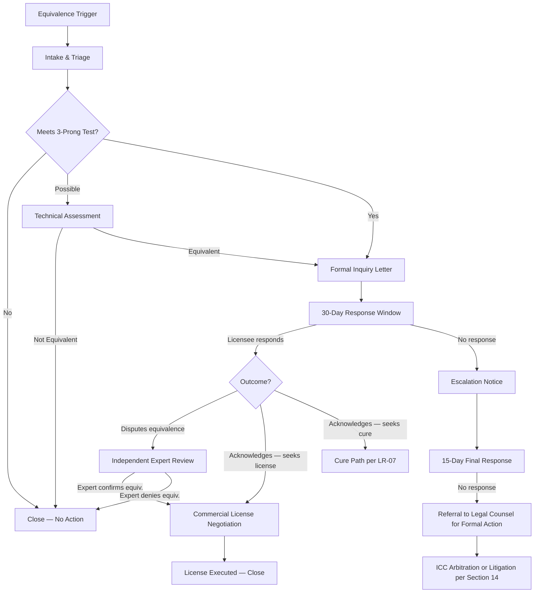

# LR-09 — Equivalence Dispute Workflow

**Ref:** O-08 (Medium) | **SAL v6.0 Sections:** 1 (Functional Equivalence), 4.4, 14
**Date:** 2026-03-05 | **Status:** RECOMMENDATION — Pre-Litigation Process

---

## 1. Purpose

Define a formal pre-litigation dispute path for when Zer0pa identifies (or is informed of) a system that may be a Substantially Similar Implementation. This workflow ensures consistent, documented, and commercially productive handling of equivalence claims — prioritizing commercial licensing over litigation.

> [!TIP]
> **Strategic principle:** Every equivalence dispute is a potential commercial licensing deal. The workflow should funnel parties toward a Commercial License, not toward court.

---

## 2. Dispute Lifecycle

---

## 3. Detailed Stages

### Stage 1: Intake & Triage (Day 0–5)

| Step | Action | Owner |
|------|--------|-------|
| 1.1 | Potential equivalent system identified (internal scan, user report, public disclosure) | License compliance officer |
| 1.2 | Initial assessment against the 3-prong test (LR-08 criteria) | Technical lead + legal counsel |
| 1.3 | Determine Prior Access status (has the party accessed ZPE-IMC?) | License compliance officer |
| 1.4 | Triage decision: Close, Monitor, or Proceed to Formal Inquiry | Legal counsel |

**Triage threshold:** Proceed to Formal Inquiry only if the system meets **at least 2 of 3 prongs** with reasonable confidence, OR if the party has confirmed Substantive Prior Access.

### Stage 2: Formal Inquiry Letter (Day 5–10)

Send a **non-threatening inquiry letter** (not a demand letter) that:

1. Identifies the system that may be a Substantially Similar Implementation
2. References the specific prongs of the Functional Equivalence Test that appear to be met
3. Asks the recipient to explain their system's architecture in sufficient detail to assess equivalence
4. Offers to discuss a Commercial License if the system falls within scope
5. **Does NOT threaten termination or litigation** in the initial letter
6. Provides a 30-day response window

> [!IMPORTANT]
> The initial letter should be commercially constructive, not legally aggressive. The goal is a licensing deal, not a lawsuit.

### Stage 3: Response Assessment (Day 10–40)

| Response | Action |
|----------|--------|
| Party disputes equivalence and provides technical detail | Proceed to Independent Expert Review (Stage 4) |
| Party acknowledges equivalence and requests Commercial License | Proceed to Commercial License negotiation |
| Party acknowledges but claims exemption (<$10M revenue, academic, etc.) | Verify exemption; if valid, close with monitoring note |
| No response | Send Escalation Notice — 15-day final response window |

### Stage 4: Independent Expert Review (if disputed)

| Step | Detail |
|------|--------|
| Expert selection | Mutually agreed technical expert; if cannot agree within 14 days, each party selects one and the two select a third |
| Scope | Expert applies the Functional Equivalence Test Standard (LR-08) to both systems |
| Access | Expert receives access to (a) ZPE-IMC source code and architecture, (b) the disputed system's architecture (under NDA) |
| Timeline | Expert opinion within 30 days of engagement |
| Cost | Zer0pa bears initial cost; if equivalence is confirmed, the other party bears 50% |
| Effect | Expert opinion is advisory, not binding — but carries significant evidentiary weight |

### Stage 5: Resolution

| Outcome | Action |
|---------|--------|
| **Commercial License executed** | Close file; record in licensing database |
| **Equivalence denied by expert** | Close file; no further action |
| **Party refuses to engage** | Referral to legal counsel for formal action (Section 14) |
| **Cure path accepted** | Party modifies system to fall outside scope; Zer0pa verifies |

---

## 4. Response SLAs

| Stage | SLA |
|-------|-----|
| Intake & Triage | 5 business days |
| Formal Inquiry Letter sent | 10 business days from intake |
| Response window (recipient) | 30 calendar days |
| Escalation notice | 5 business days after response window expires |
| Final response window (recipient) | 15 calendar days |
| Expert engagement (if disputed) | 14 business days to agree on expert |
| Expert opinion delivered | 30 calendar days from engagement |
| Commercial License negotiation | 60 calendar days target |

---

## 5. Escalation Criteria

Escalate to formal legal action (arbitration/litigation under Section 14) only if:

1. The party has failed to respond to both inquiry and escalation notices, OR
2. The expert has confirmed equivalence and the party refuses to license, OR
3. The party's system is generating commercial revenue in direct competition with Zer0pa, AND
4. Legal counsel has confirmed the claim meets the evidentiary threshold per LR-07

---

## 6. Record Requirements

Each dispute must generate a file containing:
- [ ] Intake report with initial 3-prong assessment
- [ ] Prior Access determination
- [ ] Copy of all correspondence
- [ ] Expert opinion (if obtained)
- [ ] Resolution record (license executed, closed, or escalated)
- [ ] Lessons learned (for process improvement)

Retention: 7 years from resolution.

---

*LR-09 — Prepared as operational governance document, not formal legal advice. Recommend review by IP counsel.*
