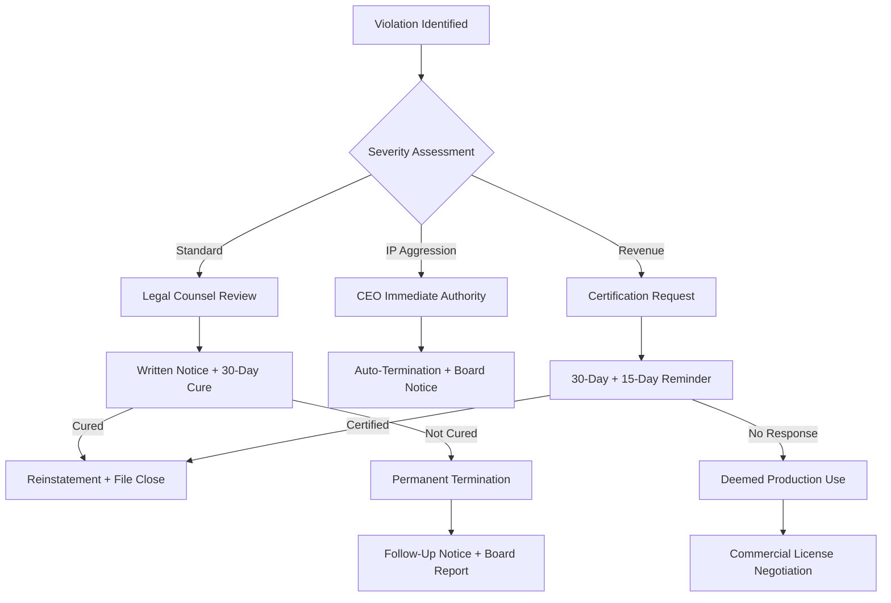

# LR-07 — Termination Trigger Governance

**Ref:** O-05 (High) | **SAL v6.0 Sections:** 5, 11
**Date:** 2026-03-05 | **Status:** RECOMMENDATION — Internal Enforcement Protocol

---

## 1. Purpose

SAL v6.0 contains multiple termination triggers but no internal governance process for how Zer0pa decides, documents, and executes termination events. This protocol defines the who, what, when, and how of enforcement — ensuring consistency, legal defensibility, and acquisition-readiness.

---

## 2. Termination Triggers Inventory

| Trigger | Section | Cure Period | Severity |
|---------|---------|-------------|----------|
| Failure to comply with any term | 11.1 | Auto-terminate; 30-day cure per 11.2 | Variable |
| Subsequent violation after cure | 11.2 | **None — permanent** | Critical |
| IP aggression (patent suit, ITC) | 5 | **None — immediate** (propose 15-day cure for demand letters per LR-06) | Critical |
| Revenue threshold non-compliance | 4.2, 4.3 | 30 days + 15-day reminder per 4.3.4 | High |
| Anti-circumvention violation | 4.5 | 30-day cure per 11.2 | High |
| Provenance/integrity breach | 4.7 | 10-day cure per 4.7 | Medium |
| False compatibility claim | 4.7 | 10-day cure per 4.7 | Medium |

---

## 3. Enforcement Protocol

### 3.1 Decision Authority

| Decision | Authority | Escalation |
|----------|----------|------------|
| Issue written notice of violation | **Legal Counsel** (or designated license compliance officer) | N/A |
| Determine cure period compliance | **Legal Counsel** | CEO for disputes |
| Trigger permanent termination (11.2 subsequent violation) | **CEO + Legal Counsel** (joint decision) | Board notification within 7 days |
| Trigger IP retaliation termination (Section 5) | **CEO** (immediate authority) | Board notification within 24 hours; legal counsel engaged within 48 hours |
| Initiate revenue audit (4.3.3) | **Legal Counsel** | CFO approval for cost allocation |

### 3.2 Evidence Threshold

Before issuing any termination notice, the following evidentiary standard must be met:

| Evidence Type | Minimum Requirement |
|--------------|-------------------|
| **Factual basis** | Written documentation of the violation, including specific Section(s) breached |
| **Verification** | At least two independent sources of evidence (e.g., repository analysis, user report, automated scan, public disclosure) |
| **Materiality assessment** | Written determination that the violation is material (not *de minimis*) |
| **Legal review** | Legal counsel has reviewed the evidence and confirmed the violation meets the threshold for the relevant Section |

### 3.3 Notification Process

**Standard Violation (Sections 4.2–4.7, general non-compliance):**

```
Day 0:   Violation identified and documented internally
Day 1-3: Legal counsel reviews and confirms violation
Day 3-5: Written notice sent to violator (via email + registered post)
         — Notice must specify: Section breached, factual basis, cure instructions
Day 5-35: 30-day cure period begins (from receipt of notice)
Day 35:   If cured → reinstatement; internal documentation of resolution
           If not cured → termination confirmed; follow-up notice sent
```

**IP Retaliation (Section 5):**

```
Day 0:   IP aggression identified (lawsuit filed, ITC action, etc.)
Day 0:   Automatic termination effective immediately (per Section 5)
Day 0-1: CEO notified; legal counsel engaged
Day 1-3: Written confirmation of termination sent to violator
Day 7:   Board notification
```

**Revenue Threshold (Section 4.3):**

```
Day 0:    Written request for certification sent
Day 0-30: 30-day compliance period
Day 30:   If no response → reminder notice sent
Day 30-45: 15-day reminder period
Day 45:    If no response → deemed Production Use by entity exceeding threshold
Day 46+:  Commercial License discussion initiated
```

---

## 4. Record Requirements

All enforcement actions must generate:

1. **Enforcement file** — containing all evidence, notices, correspondence, and internal memos
2. **Decision log** — documenting who made each decision and when
3. **Outcome record** — cure confirmation, termination confirmation, or settlement
4. **Retention period** — 7 years from resolution (or 10 years if litigation ensues)

---

## 5. Escalation Path



---

## 6. Pre-Litigation Checklist

Before initiating any legal action following termination:

- [ ] Enforcement file complete and reviewed by legal counsel
- [ ] All notices properly served and documented
- [ ] Cure period fully expired (if applicable)
- [ ] Board notification completed
- [ ] Settlement/negotiation attempt documented
- [ ] Cost-benefit analysis of litigation vs. commercial license negotiation
- [ ] Jurisdictional analysis (South Africa vs. target jurisdiction)

---

## 7. Acquisition Readiness Note

> [!TIP]
> Having a documented enforcement protocol is a **material acquisition asset**. It demonstrates:
> - Mature governance (not ad-hoc enforcement)
> - Predictable risk profile
> - Clean decision trail for due diligence
> - Consistent treatment of licensees (reduces litigation exposure)

---

*LR-07 — Prepared as operational governance document, not formal legal advice. Recommend review by IP counsel.*
